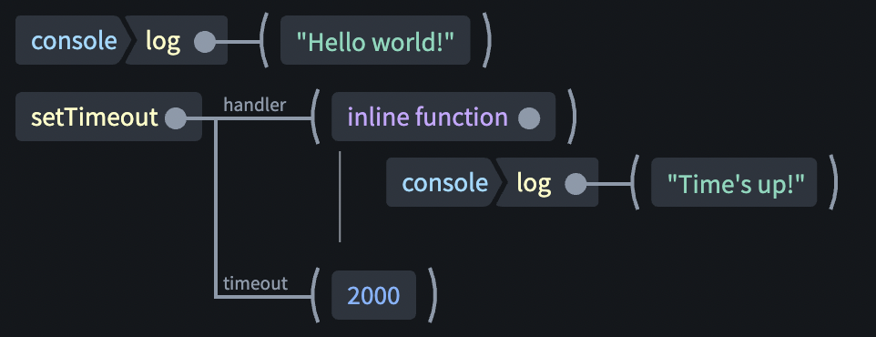

# SplootCode Editor
An experimental coding interface that's tree-based.



With a regular text-based programming language, the first step to process it is to parse it into an abstract-syntax-tree.
In the SplootCode editor, the user edits the tree directly and that tree can then include more semantic meaning.

Code no longer has to rely on cryptic punctuation characters and whitespace to represent structure. Instead the layout can be auto-generated, depending on screen size and user preferences.

That being said, building a tree-editing interface that's fast, compact and intuitive is no easy feat. This is very much a work in progress.

## Goals
 * An unrestricted implementation of JavaScript
 * Fast and easy to edit using a keyboard and autocomplete
 * A responsive layout that adapts to different screen sizes
 * Help developers avoid syntax errors and other common programming errors
 * Avoid busywork like escaping, bracket matching, wrapping and whitespace
 * Let beginners focus on the logic of their code rather than the syntax

## Development
### Requirements
You'll need to have [nodejs](https://nodejs.org/) and [yarn](https://yarnpkg.com/) installed.

### Local Dev Server
Local dev is set up using webpack-dev-server which includes hot reloading.

Install dependencies:

```$ yarn install```

Generate type information for built-in Javascript variables and functions.

```$ yarn generate-types```

The editor includes an iframe which executes the code as a preview.
You will need to run the webpack devserver for both the main app and the frame.

```$ yarn start```

And in a separate terminal:

```$ yarn start-frame```

## License
If you're planning to use this for commercial purposes, please check the [LICENSE](LICENSE) file. It is not a standard open source license.
