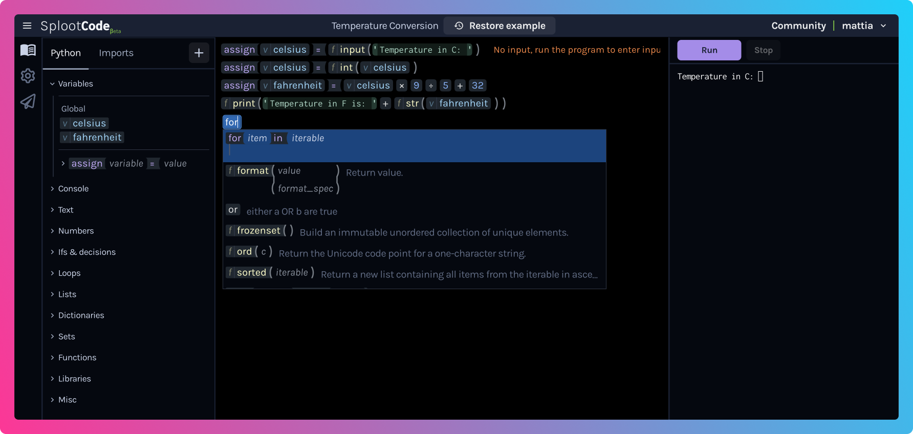

# SplootCode

## The coding environment for non-engineers
SplootCode is a coding environment aiming to reduce programming barrier to entry.



&nbsp;


## Goals
 * An unrestricted implementation of Python
 * Fast and easy to edit using a keyboard and autocomplete
 * Continuous runtime feedback without the need for a step-by-step debugger
 * Help users avoid syntax errors and other common programming errors
 * Avoid needless busywork like escaping, bracket matching, wrapping and whitespace
 * Let beginners focus on the logic of their code rather than the syntax
 * Make language features and functions easy to discover and use


## Technical details
Being a web app, SplootCode uses [Pyodide](https://pyodide.org/) (CPython compiled to WebAssembly) to run Python in the browser.

## Development
### Requirements
You'll need to have Python, [nodejs](https://nodejs.org/) and [yarn](https://yarnpkg.com/) installed.

### Local Dev
Install dependencies:

```
$ yarn install
```

Generate type information for built-in variables and functions (requires Python 3.8+).

```
$ yarn generate-types
```

Build the yarn workspace packages:

```
$ yarn build:packages
```

There are two main parts to this project, the editor and the runtime which is an iframe which executes the code.
You will need to build and run dev webservers for both the main editor and the runtime iframe.

```
$ yarn start
```

And in a separate terminal, run this serve the runtime iframe:
```
$ yarn start-frame
```

The app should become availble at `http://localhost:3000`. The runtime frame will be served from `:3001` and will be loaded automatically by the editor.

The main editor and frame communicate via `postMessage`, and they need to know each other's domains. This is configured in a dotenv file, `.env.development`. If you wish to change the above ports, you'll need to edit that file too.

**Important:** The main app must be opened on `localhost` NOT `127.0.0.1` in the URL bar for the runtime iframe to work correctly. Otherwise the runtime iframe will be assumed dead and reloaded continously. Unfortunately in older versions (earlier than Node 17) the Vite devserver will open to `127.0.0.1`, newer versions of node should default to `localhost`. If you wish to use a different origin then update `.env.development` to match.

## License
If you're planning to use this for commercial purposes, please check the [LICENSE](LICENSE) file. It is not a standard open source license.
